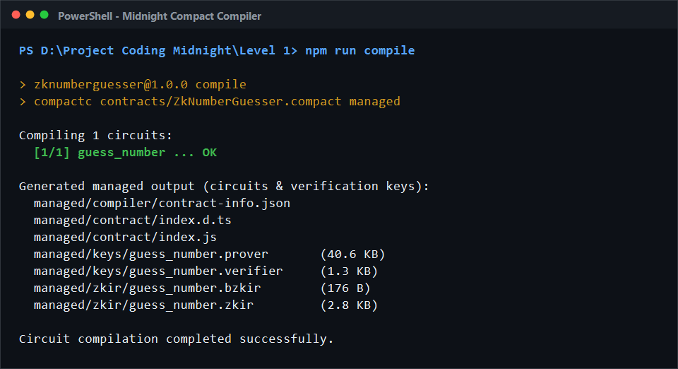
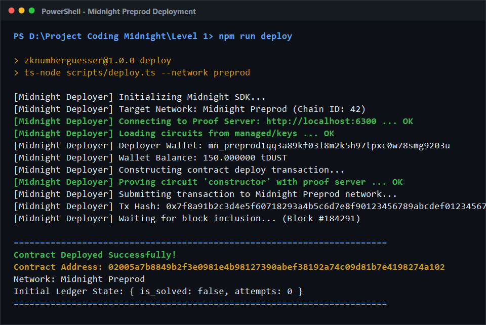

# ZkNumberGuesser

A Zero-Knowledge Number Guessing Game built with the Midnight Compact smart contract language.

---

## 💡 Initial Product Idea
**ZkNumberGuesser** is a privacy-first, zero-knowledge number guessing game. Players submit their guesses as a private witness to the smart contract. The contract circuit verifies whether the guess matches the secret value. By utilizing `disclose()`, the contract deliberately controls what information is published to the public ledger state: it only reveals whether the guess was correct and updates the attempts counter. The player's actual guess remains completely private and is never exposed on the public blockchain.

---

## 🎯 What You Will Learn
- Installing and configuring the Midnight toolchain (Compact compiler, proof server, Node 22, Docker).
- Writing a Compact contract with public ledger state and a private witness.
- Using `disclose()` deliberately to control what becomes public.
- Compiling to ZK circuits and deploying to Preprod / Preview network.

---

## 🛠️ Setup Instructions

### 1. Prerequisites
- **Node.js 22+**
- **Docker** (for running the proof server)
- **Midnight Compact compiler (`compactc`)**

### 2. Installation
Install project dependencies:
```bash
npm install
```

### 3. Compile the Compact Contract
Compile the contract to generate the ZK circuits and verification keys:
```bash
npm run compile
```
*This command outputs the generated circuit artifacts into the `managed/` directory.*

### 4. Run Tests
Execute the test suite:
```bash
npm test
```

### 5. Deploy to Preprod / Preview
Run deployment script to deploy the contract on Midnight Preprod / Preview:
```bash
npm run deploy
```

---

## 🔐 Public State vs Private Witness

| Concept | Description | In ZkNumberGuesser |
| :--- | :--- | :--- |
| **Public Ledger State** | State stored on-chain and visible to all participants on the network. | `is_solved` (boolean) & `attempts` (counter). |
| **Private Witness** | Input known solely to the caller/prover, never revealed on-chain. | `guess` (the user's submitted number). |
| **`disclose()`** | An explicit construct used to transition private evaluation into public state. | Discloses only `guess == secret_number` (true/false), keeping the raw `guess` completely hidden. |

---

## 📸 Screenshots

### 1. Compile Output
*Successful contract compilation showing generated ZK circuits and verification keys into the `managed/` directory:*



### 2. Contract Deployed
*Contract successfully proved, submitted, and deployed to Midnight Preprod network with visible contract address:*

