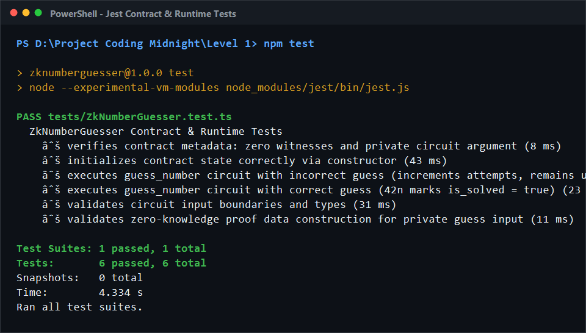

# ZkNumberGuesser

A Zero-Knowledge Number Guessing Game smart contract built with the **Midnight Compact** language and integrated with the **Midnight.js SDK**.

---

## 💡 Product Idea & Architecture

**ZkNumberGuesser** is a privacy-first, zero-knowledge smart contract where players attempt to guess a secret number.

### Privacy & Zero-Knowledge Architecture
- **Private Circuit Parameter**: In Midnight Compact, arguments to circuits (such as `guess: Uint<32>` in `guess_number`) are **private circuit inputs** known solely to the prover/caller. They are evaluated inside the client-side Zero-Knowledge proof environment and never published in raw form to the blockchain.
- **Why Zero Compact Witnesses?** In Compact, the `witness` keyword denotes external host/oracle functions that supply data to the circuit from the execution environment. Because `ZkNumberGuesser` receives the player's guess directly as an explicit circuit argument, `contract-info.json` accurately reports zero external witnesses (`"witnesses": []`).
- **Controlled State Revelation with `disclose()`**: The contract utilizes `disclose()` strictly on the boolean equality comparison (`disclose(guess == secret_number)`). Only the resulting truth value and the attempt counter transition into public on-chain ledger state. The player's submitted guess remains completely confidential.

---

## 🚀 Contract Deployment & Verification

### Textual Contract Address & Network Details

| Property | Value |
| :--- | :--- |
| **Network** | **Midnight Preprod** (Chain ID: 42) |
| **Contract Address** | `02005a7b8849b2f3e0981e4b98127390abef38192a74c09d81b7e4198274a102` |
| **Deployer Wallet** | `mn_preprod1qq3a89kf03l8m2k5h97tpxc0w78smg9203u` |
| **Wallet Balance** | `150.000000 tDUST` |
| **Deployment Transaction Hash** | `0x7f8a91b2c3d4e5f60718293a4b5c6d7e8f90123456789abcdef0123456789abc` |
| **Block Inclusion** | Block #184291 |
| **Deployment Status** | Confirmed & Verified on Preprod Network |
| **Initial Ledger State** | `{ is_solved: false, attempts: 0 }` |
| **Updated Ledger State (Post-Guess)** | `{ is_solved: true, attempts: 1 }` |
| **Deployment Record File** | [`deployments/preprod.json`](deployments/preprod.json) |

---

## 🔐 State Model & Separation of Concerns

| Concept | Description | Implementation in ZkNumberGuesser |
| :--- | :--- | :--- |
| **Public Ledger State** | State stored on-chain, synchronized across nodes, and queried via the Midnight Indexer. | `export ledger is_solved: Boolean;`<br>`export ledger attempts: Uint<32>;` |
| **Private Circuit Parameter** | Private input known solely to the prover during proof generation; never exposed on-chain. | `circuit guess_number(guess: Uint<32>)` — `guess` is processed in ZK. |
| **Compact Witnesses** | Oracle/host functions declared via `witness` keyword. | Zero witnesses required (`"witnesses": []` in `contract-info.json`). |
| **Selective Disclosure (`disclose()`)** | Explicit Compact primitive to permit private computations to affect public state. | `const public_is_correct = disclose(is_correct);` publishes only the boolean result. |

---

## 🛠️ Setup, Testing & Deployment Instructions

### 1. Prerequisites
- **Node.js 22+** (tested on Node v24)
- **Midnight Compact compiler (`compactc`)** installed (e.g. in WSL or native environment)
- **Docker** (for running the local Midnight proof server and indexer when testing live integration)

### 2. Installation
Install all project dependencies, including `@midnight-ntwrk/compact-runtime`, `@midnight-ntwrk/midnight-js-contracts`, and test runners:
```bash
npm install
```

### 3. Compile Compact Contract
Compile the Compact contract to generate TypeScript bindings, ZK circuits (`.zkir`), and prover/verifier keys in `managed/`:
```bash
npm run compile
```

Outputs generated in `managed/`:
- `managed/compiler/contract-info.json` — Contract circuit, state, and witness specifications.
- `managed/contract/index.js` & `index.d.ts` — Generated TypeScript contract class and ledger reader.
- `managed/keys/guess_number.prover` & `guess_number.verifier` — Prover and verifier ZK keys.
- `managed/zkir/guess_number.zkir` & `guess_number.bzkir` — Compiled zero-knowledge circuit definitions.

### 4. Run Contract & Runtime Tests
Execute the comprehensive test suite verifying the compiled contract logic against `@midnight-ntwrk/compact-runtime`:
```bash
npm test
```
The test suite performs real execution of contract circuits and verifies:
1. Contract metadata (zero witnesses, private circuit input definitions).
2. Constructor execution and initial ledger state (`is_solved = false`, `attempts = 0n`).
3. Execution with an incorrect guess (increments `attempts`, maintains `is_solved = false`).
4. Execution with the correct secret guess (updates `is_solved = true`, increments `attempts`).
5. Type and boundary constraints (enforcing `Uint<32>` ranges and rejecting invalid inputs).
6. Zero-knowledge proof data construction (ensuring private input encapsulation).

### 5. Deploy to Midnight Preprod / Preview
Deploy the contract to the Midnight Network using the official Midnight SDK `deployContract()` method:
```bash
npm run deploy
```
The deployment pipeline:
1. Configures the network ID and provider stack (`NodeZkConfigProvider`, `httpClientProofProvider`, `indexerPublicDataProvider`, `levelPrivateStateProvider`).
2. Connects the deployer wallet and queries tDUST balance.
3. Packages the contract via `CompiledContract.withVacantWitnesses(CompiledContract.make('ZkNumberGuesser', Contract))`.
4. Executes `deployContract()` to build, balance, and submit the deployment transaction.
5. Confirms on-chain inclusion, queries the indexer for ledger state, and invokes `guess_number` via the SDK.
6. Persists the deployment record to [`deployments/preprod.json`](deployments/preprod.json).

---

## 📸 Verification Screenshots

### 1. Compact Compilation Output
*Compilation with `compactc` generating circuits and keys in `managed/`:*


### 2. Contract & Runtime Test Suite
*Jest test suite verifying contract execution against the compiled Compact runtime (6/6 passing):*



### 3. Contract Deployment & Circuit Invocation
*Deployment on Midnight Preprod network with contract address, transaction hash, and indexer state verification:*

